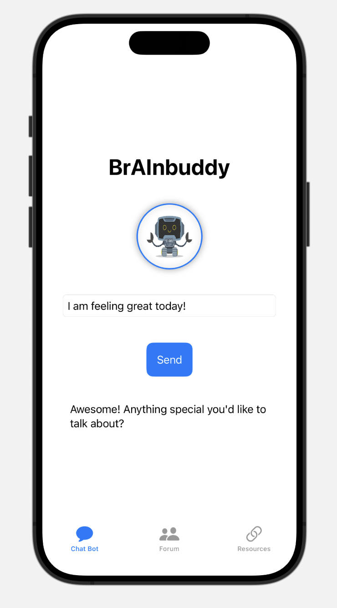
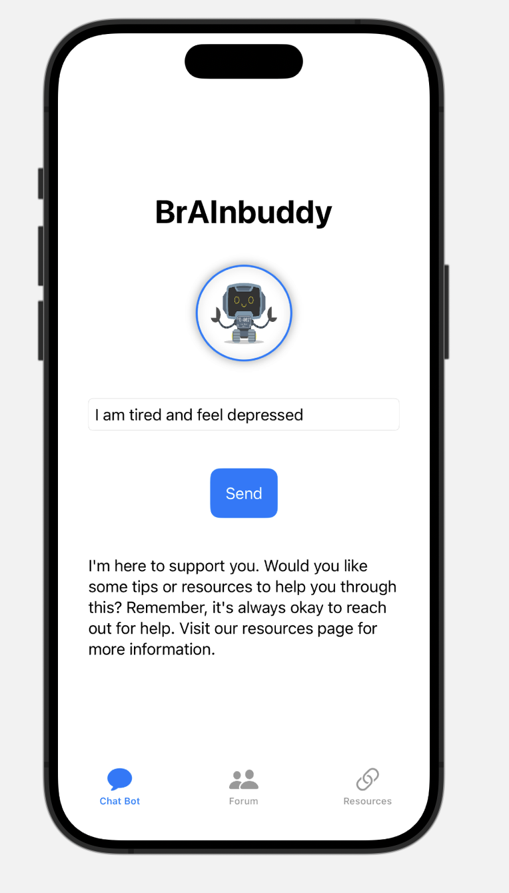

# BrAInbuddy Prototype

A simple chatbot prototype that uses sentiment analysis to respond to user input, incorporating a mental health resources tab and a peer support forum.

## Features

- **Sentiment Analysis**: Provides AI-driven responses based on the sentiment of the user's input (positive, neutral, or negative).
- **Guided Support**: Suggests forums or resources based on user sentiment and specific keywords.
- **Gamification**: Awards points to users based on the length of their input to encourage engagement.
- **Static Peer Support Forum**: Displays sample interactions from other users to simulate a support environment.
- **Helpful Resources**: Links to local therapists and mental health resources are provided to users based on context.

## App Preview

### Homepage


### Positive Response


### Sad Response that Guides to Resources Page


### Neutral Response


### Anxious Response that Guides to Forums Page


### Forums Page


### Resources Page


## Dependencies

Install the necessary dependencies using:

```bash
pip install flask textblob
